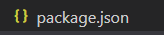
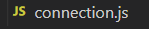
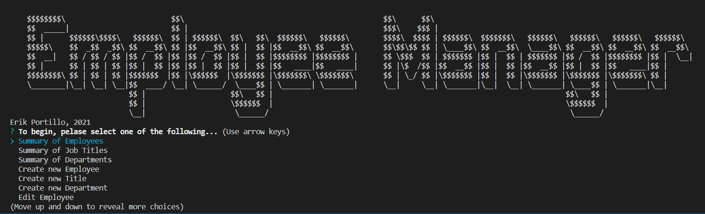
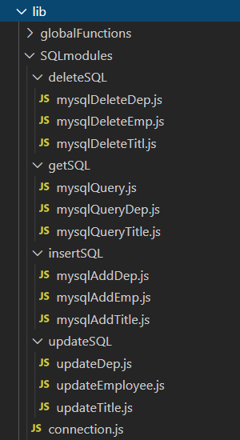
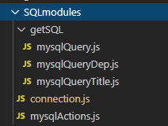

# Employee-Manager

## Introduction
Employee Manager is a node.js application that allows the management of a mySQL-based, employee organizational database. From reading, writing, and deleting various aspects of a specific organiztion, this application allows for these actions in a user-friendly manner as compared to working directly with a mysql database.

## Getting Started...

* [Node.js](https://nodejs.org/en/) => Be sure to INSTALL Node.js before cloning this repository for your personal use. Node.js allows JavaScript to control and be utilized in Terminal and mysql database.

* package.json => Be sure to send 'npm i' in the terminal before initiating 'npm start' to use the application.

* SQL Seed => Be sure to CREATE your copy of your employee manager database! Located within ./Assetts is a .sql file with the code needed for your database AND some demonstration INSERT INTO data.

* SQL DB Connection => Be sure to UPDATE the 'connection.js' file in the './SQLmodules' folder with your specific DB credentials!

## User Interactions

The code will provide a list of options that you can use to create and manage your team!

### Summarization
The summarization functions allow the user to quickly see, in a cleanly displayed table, all the information within any of the three given tables, "Employees", "Departments", and "Titles".

### Create New
The create functions allow the user to create new Employees, Titles, and Departments! Inquirer is used to help walk through each of the elements of these various aspects of each, from desired names, titles, salaries, and more.

### Editing & Deleting
As the create functions, edit allows the user to start with a selected Employee, Title, or Department and editing any or all aspects of those items! Additionally, DELETE is a provided action here!

## How it Works

### Node.js & Inquirer
The application utilizes the terminal to [inquire](https://www.npmjs.com/package/inquirer) and walk through the steps in any of the actions above. 

### Console.table
Better than console.log, [console.table](https://www.npmjs.com/package/console.table) allows for a more clear table of information to be shown, rather than a given returned batch of information (as an object) from mysql queries.

### mySQL
[mySQL](https://www.mysql.com/) is where the data is stored! The application can do all but create the initial database and connection. All further interactions are handled in this application, leaving mySQL to the "backend".

## Desired Improvements

### Consolidation of Modules
1. **Too many scripts...** Much of the "lib" folders could be consolidated into a handful of module js files. Instead of over a dozen mySQL script files, using more variables and refactoring could result in fewer files!

*Update 02-13-21:* By finding the common thread between all the various SQL actions, aside from the "gets", it was possible to move a chunk of the SQL statement to the point in the scripts where those sql scripts were called. What's left was able to be consolidated. Once the INSERT, DELETE, and UPDATE scripts were consolidated to a single script each, those three actions could be consolidated to a single file and exported.

This sets up the potential to refine that script further. With more time it would be possible to consolidate further.

## Credits

Created by: Erik Portillo, 2021

GitHub: [RasputinForever](https://github.com/rasputinforever)

Email: [erik.justin.portillo@gmail.com](erik.justin.portillo@gmail.com)